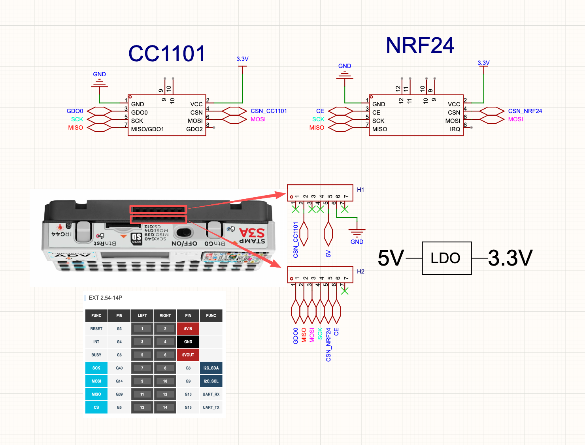

# CC1101 + NRF24 Dual-Radio Module for M5Stack Cardputer ADV

> **A simple guide to wiring CC1101 (Sub-GHz) and NRF24L01+ (2.4 GHz) together on the M5Stack Cardputer ADV** — one module with two radios, switchable from Bruce firmware. No DIP switches, no jumper caps, no hardware fiddling after setup.

*Designed and tested by [PINGEQUA](https://www.pingequa.com/) — open-sourced for the Cardputer ADV community.*

---

## What You Get

A working dual-radio expansion for the M5Stack Cardputer ADV: **Sub-GHz** (433 / 868 / 915 MHz, depending on your antenna) and **2.4 GHz**, switchable from inside Bruce firmware.

This guide gives you the modules to buy, the wiring to follow, and the configuration file to drop onto your Cardputer ADV. About an hour of work if you're comfortable with basic soldering or jumper wires.

---

## Parts List

Two off-the-shelf modules:

| Module | Part Number | Notes |
|---|---|---|
| NRF24L01+ | **AS01-ML01DP5** | High-power version with built-in PA + LNA |
| CC1101 | **AS07-M1101D-SMA** | Has a built-in SMA antenna connector |

Plus:

- 1× 3.3V LDO regulator (AMS1117-3.3 or similar, 300 mA+)
- Hookup wire or Dupont jumpers
- 2× SMA antennas (one for your Sub-GHz band, one for 2.4 GHz)

---

## Wiring

**Shared SPI bus** (one bus, both modules):

| Signal | GPIO |
|---|---|
| SCK  | GPIO 40 |
| MOSI | GPIO 14 |
| MISO | GPIO 39 |

**CC1101** (Sub-GHz):

| Signal | GPIO |
|---|---|
| CSN  | GPIO 13 |
| GDO0 | GPIO 5  |
| GDO2 | not connected |

**NRF24** (2.4 GHz):

| Signal | GPIO |
|---|---|
| CSN | GPIO 6 |
| CE  | GPIO 4 |
| IRQ | not connected |

**Power**:

| Signal | Source |
|---|---|
| 5V in (from Cardputer ADV) | EXT Pin 6 |
| 3.3V out (to both modules) | via LDO   |
| GND | EXT Pin 4 |

See [`docs/pin-mapping.md`](docs/pin-mapping.md) for the full Cardputer ADV header reference.

**Before powering on:** check with a multimeter that the two CSN lines (CC1101 GPIO 13 and NRF24 GPIO 6) are **not** shorted together. The SPI lines (SCK / MOSI / MISO) should be continuous across both modules.

---

## Configuration

Edit the Cardputer ADV's existing `brucePins.conf`. Locate the `[cc1101]` and `[nrf24]` sections and set these parameter values:

| Section    | Key   | Value |
|------------|-------|-------|
| `[cc1101]` | `cs`  | `13`  |
| `[cc1101]` | `io0` | `5`   |
| `[nrf24]`  | `cs`  | `6`   |
| `[nrf24]`  | `io0` | `4`   |

**Important:** the file exists in **two locations** — on the **SD card** and in the device's internal **LittleFS**. You must edit **both copies** with the same values. Bruce reads from one or the other depending on firmware version, so editing only one is unreliable. After editing both, restart the Cardputer ADV.

To access the WebUI for editing: on the Cardputer go to **Files → WebUI**, connect to your Wi-Fi, then open the IP address shown on screen in a browser. Default login: `admin` / `bruce`.

---

## Verify It Works

After restart:

1. **CC1101 check:** Bruce → `RF` → `Config` → set `RF Module` to `CC1101`, set your frequency (433.92 / 868.30 / 915.00 MHz), open the Spectrum Analyzer. You should see RF noise plus spikes from nearby remotes.
2. **NRF24 check:** Open any NRF24 tool (e.g. NRF Spectrum), select `SPI Mode`. You should see 2.4 GHz channel activity (Wi-Fi makes a good reference).
3. **Switch test:** Open CC1101, exit, open NRF24. The transition should be instant — no reset needed. That's the auto-switching working.

If anything doesn't work, see [`docs/troubleshooting.md`](docs/troubleshooting.md).

---

## Notes

- This works only on the **Cardputer ADV** (Stamp S3A version). The original Cardputer v1.0 / v1.1 has a different expansion slot and will not work.
- Bruce firmware is not pre-installed — flash it yourself from [github.com/pr3y/Bruce](https://github.com/pr3y/Bruce).
- Bruce's `brucePins.conf` uses the `io0` field for different signals depending on the chip: GDO0 for CC1101, CE for NRF24. Bruce's source handles this internally.

---

## Also Available

Don't want to build from scratch? The same design is also available as a ready-made module — the **Hydra RF series** by PINGEQUA, in 433 / 868 / 915 MHz variants. Search "Hydra RF" or visit [pingequa.com](https://www.pingequa.com/) if you're interested.

---

## License

Documentation under [MIT License](LICENSE). Hardware diagrams under CC BY-SA 4.0.

PRs and issues welcome — especially build photos, alternative module combinations, and translations.
